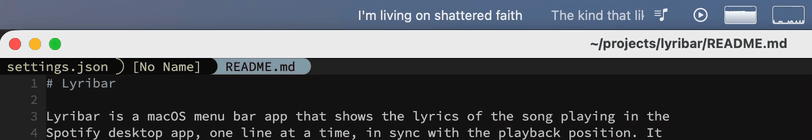

# Lyribar

Lyribar is a macOS menu bar app that shows the lyrics of the song playing in the
Spotify desktop app, one line at a time, in sync with the playback position. It
lives in the status bar: no Dock icon, no window other than its settings. Lyrics
come from [LRCLIB](https://lrclib.net), so there is no account and no API key to
set up. Optionally, Lyribar can also fetch the lyrics Spotify itself shows; see
[Spotify lyrics](#spotify-lyrics-optional-unofficial).



## Requirements

- macOS 15 or later
- The Spotify desktop app (the web player and other players are not supported)

## Install

1. Download `Lyribar-<version>.zip` from the
   [releases page](https://github.com/todesking/lyribar/releases) and unzip it.
2. Move `Lyribar.app` to `/Applications`.
3. The app is signed ad hoc, not notarized, so the first launch needs a detour:
   right-click the app and choose **Open**, then confirm the dialog. If macOS
   still refuses, remove the quarantine flag and open it normally:

   ```sh
   xattr -dr com.apple.quarantine /Applications/Lyribar.app
   ```

On the first launch macOS asks for permission to control Spotify: Lyribar reads
the current track and the playback position through Apple events. Allow it, or
Lyribar cannot see what is playing. The answer can be changed later in **System
Settings > Privacy & Security > Automation > Lyribar**.

## Usage

Start Spotify and play something. The status item shows the lyrics, then the
track and artist, then the Lyribar icon. The lyrics are laid out on one long
ribbon that scrolls with the playback position: the line being sung starts in
the middle of the lyric area at the moment it begins, the lines before
and after it are visible around it, and only the current line is drawn in the
full text color. Seeing the neighbouring lines makes it easy to find your place
even when the timings of the lyrics are a little off. An instrumental passage
shows up as a gap, and a paused track keeps the ribbon where it is.

With **Lyrics display** set to **Current line only**, the item shows just the
current line instead: a line that is too wide scrolls back and forth, a short one
sits at the left, and an instrumental passage leaves the space empty.

While the track has lyrics the item keeps the configured maximum width in both
modes, so the rest of the menu bar does not shift from line to line. The track
and artist are truncated instead of scrolling. Without lyrics for the track the
item shrinks to the track and artist, and when Spotify is not running or playback
is stopped only the icon is left.

Clicking anywhere on the status item opens the menu:

- the current track and artist, or **Not playing**
- the state of the lyrics: **Loading lyrics…**, **Lyrics from LRCLIB** or
  **Lyrics from Spotify**, **No lyrics found**, or **Failed to load lyrics**
- **Settings…** (⌘,)
- **Quit Lyribar** (⌘Q)

## Settings

- **Maximum width** — how much of the menu bar the status item may take,
  150 to 600 pt, 300 pt by default.
- **Lyrics display** — **Scrolling lyrics** (the default) scrolls every line
  along with the playback; **Current line only** shows one line at a time.
- **Show track name and artist** — on by default.
- **Launch at login** — registers the app as a login item.
- **Spotify lyrics (unofficial)** — stores or removes the `sp_dc` cookie; see
  [Spotify lyrics](#spotify-lyrics-optional-unofficial).
- **Clear lyrics cache** — deletes the cached lyrics; the current size is shown
  next to the button.

The settings window closes with the close button or ⌘W.

## Spotify lyrics (optional, unofficial)

Spotify has synced lyrics of its own, and Lyribar can use them. They are looked
up by track ID, so they always belong to the track that is playing, and they
cover tracks LRCLIB does not have. This is off by default: without the setup
below Lyribar uses LRCLIB alone, exactly as before.

To turn it on, give Lyribar the `sp_dc` cookie of your Spotify web session:

1. Log in to <https://open.spotify.com> in a browser.
2. Open the developer tools and go to **Application** (**Storage** in Safari)
   **> Cookies > `https://open.spotify.com`**.
3. Copy the value of the `sp_dc` cookie.
4. Paste it into **Settings… > Spotify lyrics (unofficial)** and click **Save**.

The section shows **Connected** once Spotify has accepted the cookie, and lyrics
that are not cached yet come from Spotify first, then from LRCLIB. Lyrics cached
earlier stay as they are until **Clear lyrics cache** is used. **Remove** deletes
the cookie and turns the feature off again.

Before using it, know what it is:

- It talks to a private Spotify API, the one the web player uses. That is not
  permitted by the Spotify Developer Terms. Use it at your own risk.
- `sp_dc` is the session of your Spotify account. Never give it to anyone else.
  Lyribar keeps it in the macOS Keychain and sends it to `open.spotify.com` only.
- Getting an access token takes a secret that changes from time to time. Lyribar
  downloads the published copy from the
  [xyloflake/spot-secrets-go](https://github.com/xyloflake/spot-secrets-go)
  repository on GitHub whenever it needs a token.

When it breaks — Spotify changes something, the secret is outdated, the cookie
expires — Lyribar falls back to LRCLIB. If the secrets move to another place,
point Lyribar at the new URL (https only) and restart it:

```sh
defaults write com.todesking.lyribar spotifySecretsURL <url>
```

Lyribar is signed ad hoc, so after an update macOS may ask again whether Lyribar
may use the Keychain item. Choose **Always Allow**.

## Troubleshooting

**Only the icon shows, and the menu says "Not playing".** Lyribar only follows
the Spotify desktop app, not the web player or another music app. Check that
Spotify is running and playing, and that Lyribar is allowed under System
Settings > Privacy & Security > Automation.

**The menu says "No lyrics found".** LRCLIB has no synced lyrics for that track
(and neither has Spotify, if Spotify lyrics are set up). Lyribar deliberately
ignores unsynced (plain) lyrics, so a track that only has those counts as a miss.

**The menu says "Failed to load lyrics".** The request to LRCLIB (or to Spotify,
with nothing found on LRCLIB either) failed — often a network hiccup. Lyribar retries a server error or a broken connection right away
(three times, backing off from half a second to two), and once more 30 seconds
later. If that last attempt fails too it gives up until the track changes;
switching to another track and back triggers a new attempt.

**The menu says "Spotify cookie was rejected".** Spotify no longer accepts the
stored `sp_dc` cookie, and LRCLIB had nothing for the track either. Log in to
<https://open.spotify.com> again, then remove the cookie in the settings and save
the new one.

**The lyrics run ahead of or behind the music.** The timings come from LRCLIB and
are as good as the file somebody uploaded there.

## How it works

- Track changes and play/pause arrive as the `com.spotify.client.PlaybackStateChanged`
  distributed notification. Spotify posts no notification for a seek, so while
  playing, Lyribar also asks Spotify for `player position` over AppleScript once
  a second; between those points the position is interpolated.
- On a track change the lyrics are looked up on LRCLIB: `/api/get` by title,
  artist and duration, falling back to `/api/search` by title and artist. Only
  synced lyrics are used.
- With an `sp_dc` cookie stored, Spotify is asked first: the cookie and a TOTP
  are traded for a web player access token, which is kept in memory only, and
  the lyrics come from the `color-lyrics` endpoint by track ID. No lyrics there,
  or any error, and the lookup moves on to LRCLIB.
- Fetched lyrics are cached as one JSON file per track under
  `~/Library/Caches/com.todesking.lyribar/lyrics/`, so a track played again works
  offline.

## Building

The Xcode toolchain is required (`xcode-select -p` should point at
`/Applications/Xcode.app/Contents/Developer`).

```sh
swift build                       # debug build
swift test                        # tests
swift run                         # run from the command line

Scripts/build-app.sh              # build/Lyribar.app for this Mac
Scripts/build-app.sh --universal  # arm64 + x86_64
Scripts/release.sh                # universal build/Lyribar.app + build/Lyribar-<version>.zip
Scripts/generate-icon.sh          # redraw Resources/AppIcon.icns
```

The version comes from `CFBundleShortVersionString` in `Resources/Info.plist`.

## License

MIT. See [LICENSE](LICENSE).

Lyribar is not affiliated with, endorsed by, or connected to Spotify AB.
